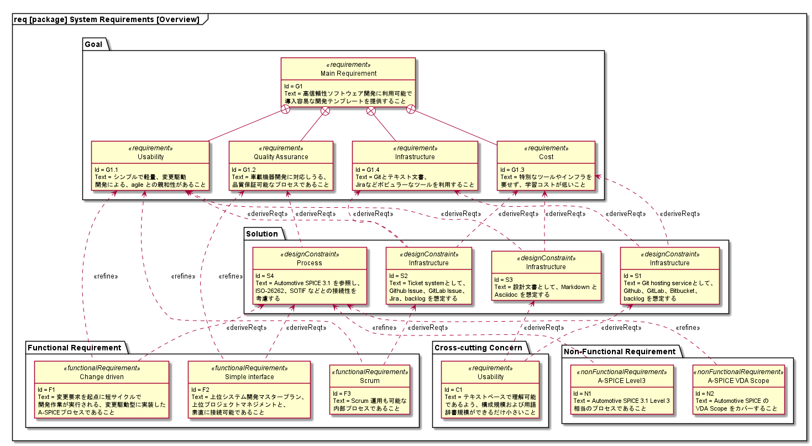
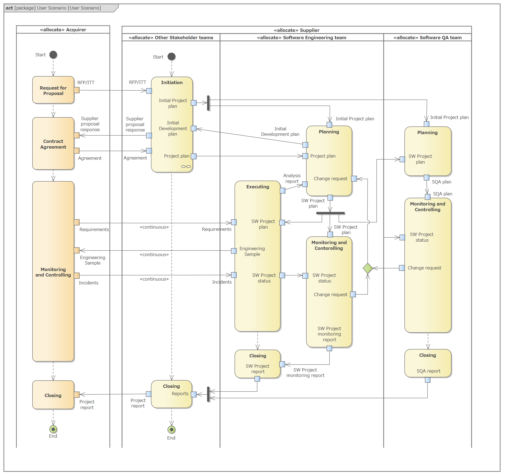

# [@ SYRQ] Ghost System requirements

## Overview

## [@ G] Goal

### Main Goal

| @ReqtID | Name | Text |
| ------- | ---- | ---- |
| G1-gh000      | Main Requirement | 高信頼性ソフトウェア開発に利用可能で導入容易な開発テンプレートを提供すること。
| | @Rationale  | プロセス改善に際し、現状ベースではなく新規構築したいニーズに応えるため。
| | @Trace      | // Stakeholder Requirements の項目を参照する

### [#nest G1] Sub Goals

| @ReqtID | Name | Text |
| ------- | ---- | ---- |
| G1.1-gh000    | Usability | シンプルで軽量、変更駆動開発による、agile との親和性があること
| | @Rationale  |
| | @Trace      |
| G1.2-gh000    | Quality Assurance | 車載機器開発に対応しうる、品質保証可能なプロセスであること
| | @Rationale  |
| | @Trace      |
| G1.3-gh000    | Cost | 特別なツールやインフラを要せず、学習コストが低いこと
| | @Rationale  |
| | @Trace      |
| G1.4-gh000    | Infrastructure | Gitとテキスト文書、Jiraなどポピュラーなツールを利用すること
| | @Rationale  |
| | @Trace      |

### Context

### Assumption

### Justification

## [@ S] Strategy

| @ReqtID | Name | Text |
| ------- | ---- | ---- |
| S1-gh000      | \<\<designConstraint>> Infrastructure | Git hosting serviceとして、Github、GitLab、Bitbucket、backlog を想定する
| | @Rationale  |
| | @Trace      | G.G1.3-gh000, G.G1.4-gh000
| S2-gh000      | \<\<designConstraint>> Infrastructure | Ticket systemとして、Github Issue、GitLab Issue、Jira、backlog を想定する
| | @Rationale  |
| | @Trace      | G.G1.1-gh000, G.G1.3-gh000, G.G1.4-gh000
| S3-gh000      | \<\<designConstraint>> Infrastructure | 設計文書として、Markdown と Asciidoc を想定する
| | @Rationale  |
| | @Trace      | G.G1.1-gh000, G.G1.3-gh000
| S4-gh000      | \<\<designConstraint>> Process | Automotive SPICE 3.1 を参照し、ISO-26262、SOTIF などとの接続性を考慮する
| | @Rationale  |
| | @Trace      | G.G1.2-gh000

## [@ F] Functional Requirement

### Main Goals

| @ReqtID | Name | Text |
| ------- | ---- | ---- |
| F1-gh000      | \<\<functionalRequirement>> Change driven | 変更要求を起点に短サイクルで開発作業が実行される、変更駆動型に実装したA-SPICEプロセスであること
| | @Rationale  |
| | @Trace      | G.G1.1-gh000, S.S4-gh000
| F2-gh000      | \<\<functionalRequirement>> Simple interface | 上位システム開発マスタープラン、上位プロジェクトマネジメントと、素直に接続可能であること
| | @Rationale  |
| | @Trace      | G.G1.2-gh000, S.S4-gh000
| F3-gh000      | \<\<functionalRequirement>> Scrum | Scrum 運用も可能な内部プロセスであること
| | @Rationale  |
| | @Trace      | G.G1.1-gh000, S.S2-gh000

### Context

#### ユーザー観点

- 上位システム開発マスタープランとの接続をシンプルにするため、まず上位側からみたユーザーシナリオを定めた。
- また、上位マスタープランのモデルを定めこれを前提する。
- 以上から、ユーザーから見たユースケースを抽出する土台とする。

#### システムアーキテクチャ観点

- 次にアーキテクチャへの検討を加える。本来アーキテクチャ設計書（SYS.3）にて検討するべき内容ではあるが、システムの挙動をモデリングするためにある程度のシステムモデリングを行う。
- また、クライアントからみたサプライヤー内部にソフトウェア開発チームから見た複数のステークホルダーが存在するため、上記モデリングが必要となる。
- アクターとして、4種類のチームを想定する。
  - システム開発部がとりまとめる、HWチームがとりまとめる、SWが取りまとめる（セールスがラッパーになる）など大きく３パターンがあるが、いずれにせよ上位プロジェクトが存在する。
  - 上位プロジェクトがシステムエンジニアリングをどこまでやってくれるかはケースによる（SWとしては情報をもらうだけでいいのか、または自分でやるのか）
  - クライアントは通常上位プロジェクトの外に存在するが、社内プロジェクトの場合には上位プロジェクトチームと一致する場合もある。
  - 4種類のチーム全てを含めて、ステークホルダーとする。
- 製品開発プロジェクトの標準パターンを定める。
  - ES、共同テストなどの用語を定める
  - 開発プロジェクトの大きな流れを定める

#### Activity diagram

- [ ] Supplyer → Supplier
- [ ] Client はどうしよう。顧客のほうが自然か。acquirer がよさげ（@33001）
- [ ] SW Engineering へ変更する。
- [ ] プロジェクトの3階層（Customer project、Supplier project、Software project）

### [@ #nest F1] Change driven development process

| @ReqtID | Name | Text |
| ------- | ---- | ---- |
| I1-gh000      | 開発依頼 | 委託元組織は、開発依頼を発行できる
| | @Rationale  |
| | @Trace      |
| I2-gh000      | ステータス情報取得 | ステークホルダーは、開発状況に関する情報を取得できる
| | @Rationale  |
| | @Trace      |
| I3-gh000      | サンプル要求 | ステークホルダーは、検証用サンプルを受け取ることができる
| | @Rationale  |
| | @Trace      |
| I4-gh000      | 変更依頼 | ステークホルダーは、変更要求を発行できる
| | @Rationale  |
| | @Trace      |
| I5-gh000      | 不具合指摘 | ステークホルダーは、不具合を指摘し改修を依頼することができる
| | @Rationale  |
| | @Trace      |
| I6-gh000      | リリース要求 | 委託元組織は、製品リリースを要求できる
| | @Rationale  |
| | @Trace      |

### [@ #nest F2] Simple interface

| @ReqtID | Name | Text |
| ------- | ---- | ---- |
| I1-gh000      | \<\<interfaceRequirement>> 開発プラン整合 | Engineering Sample, Pilot Run など顧客組織のプランと内部プランとを接続できること
| | @Rationale  |
| | @Trace      |
| I1-gh000      | \<\<interfaceRequirement>> スケジュール整合 | マスタープランに基づく到達予測が可能であること
| | @Rationale  |
| | @Trace      |

### [@ #nest F3] Scrum

| @ReqtID | Name | Text |
| ------- | ---- | ---- |
| R1-gh000      | Scrum コンセプトとのマッピング | 内部プロセスは、Scrum のコンセプトへ対応付け可能であり、Scrum 運用を容易に実現可能であること
| | @Rationale  |
| | @Trace      |

## [@ C] Cross-Cutting Concerns

| @ReqtID | Name | Text |
| ------- | ---- | ---- |
| C1-gh000      | Usability | テキストベースで理解可能であるよう、構成規模および用語辞書規模ができるだけ小さいこと
| | @Rationale  |
| | @Trace      | S.S1-gh000, S.S3-gh000

## [@ N] Non-Functional Requirement

| @ReqtID | Name | Text |
| ------- | ---- | ---- |
| N1-gh000      | \<\<nonFunctionalRequirement>> A-SPICE Level3 | Automotive SPICE 3.1 Level 3相当のプロセスであること
| | @Rationale  |
| | @Trace      | S.S4-gh000
| N2-gh000      | \<\<nonFunctionalRequirement>> A-SPICE VDA Scope | Automotive SPICE のVDA Scope をカバーすること
| | @Rationale  |
| | @Trace      | S.S4-gh000

[Automotive SPICE Requirement Analysis Version 1.1.0](https://docs.google.com/spreadsheets/d/1d8Ape4tjnYrs0BlzwShg9jB5Lbrm1BTp-8rOd5me9es/)

## [@ D] Domain Knowledge

### プロセス定義対象範囲について

プロセステンプレートをテーラーリングしたプロセスを、プロジェクトにおいて実行する。

#### プロジェクトの位置づけ

3階層。

1. Acquirer project
2. Supplier project
3. Software project  ← これが対象。

#### Software project team の構成

独立した2チームによる構成。

1. SW Engineering team
2. SW QA team

- Ghostは 1 + 2 の両方を含む defined process だが、3.1 中心で 3.2 は薄め。
- とはいえ、小さな企業では SQA にも困っているのではないか？

### プロセスの目的について

目的に照らして指標があり、成熟度の計測が成立する。
指標のもとになっている目的と指標を簡単に整理したい。

最上位には製品開発全体の品質管理があるので、その部分としてのソフトウェア品質管理を簡単に説明すればよいか。

### プロジェクトの用語について

PMBOK + SCRUM から、できるだけ少数の用語を採用する。

#### PMBOK

- ５プロセス

#### SCRUM

1. Epic
2. Task
3. Subtask

- Sprint などの運用については言及しない方針

- User story、Product backlog などの概念はエンジニアリングの手法として位置付ける？ PB は単に Feature でもよいかもしれない。

### その他の用語

ASPICE 同様、33001 を参照する。

- [ ] 読む。 http://www.kikakurui.com/x3/X33001-2017-01.html

> 取得者（acquirer）= 供給者から，製品又はサービスを，取得又は調達する利害関係者。

