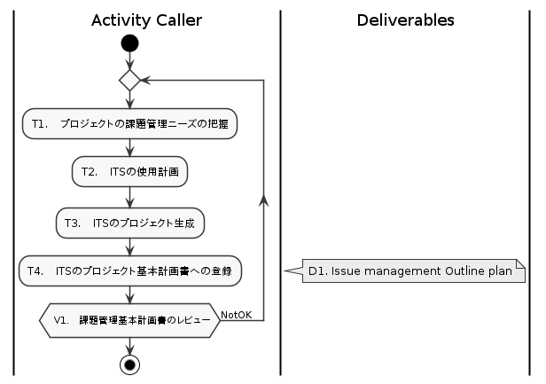

# [@ ISM] Issue Management

[@doc ghost 0.4]

本プロセスは、アプリケーションレイヤの各プロセスから利用される課題管理プロセスを定めます。

Process roles, Work products, Activitiesの各項目はDescriptionに示す考え方・ルールに基づいていため、Ghostプロセス初見者は最初にDescriptionを通読してください。

 

## CONTENTS <!-- omit in toc -->

- [1. DESCRIPTION](#1-description)
  - [1.1. Purpose](#11-purpose)
  - [1.2. Issue](#12-issue)
  - [1.3. Ticket as a Evidence](#13-ticket-as-a-evidence)
  - [1.4. Issue hierarchy and Work package](#14-issue-hierarchy-and-work-package)
    - [1.4.1. Hierarchy](#141-hierarchy)
    - [1.4.2. Work package](#142-work-package)
  - [1.5. Issue types and Plugin types](#15-issue-types-and-plugin-types)
  - [1.6. Application Process Interface](#16-application-process-interface)
- [2. PROCESS ROLES](#2-process-roles)
  - [2.1. [@role] Activity Caller](#21-role-activity-caller)
  - [2.2. [@role] System Administrator](#22-role-system-administrator)
- [3. WORK PRODUCTS](#3-work-products)
  - [3.1. [@workproduct] Issue management plan](#31-workproduct-issue-management-plan)
- [4. ACTIVITIES](#4-activities)
  - [4.1. [@activity] Initiate](#41-activity-initiate)
  - [4.2. [@activity] Plan](#42-activity-plan)
  - [4.3. [@activity] Monitor](#43-activity-monitor)
- [5. APPENDIX](#5-appendix)
  - [5.1. 参考：Automotive SPICE V3.1の主要関連項目](#51-参考automotive-spice-v31の主要関連項目)

 

## 1. DESCRIPTION

### 1.1. Purpose

Issue Managementプロセスは、アプリケーションプロセスで発生する複数タイプのIssue（課題）を管理し、課題毎の活動を計画・追跡・記録し、ステータス参照を可能にする。

[参考：Automotive SPICE V3.1の主要関連項目](#51-参考automotive-spice-V31の主要関連項目)

 

### 1.2. Issue

Ghostではプロジェクトマネジメントの考え方として、WBS（Work breakdown structure）をベースにしない。
課題をベースにプロジェクトを管理する。

WBSベースのプロジェクトマネジメントでは、日々の活動はスケジュール化したWBSから取り出されるが、同時に不具合管理リスト、リスク管理リストなど他のリストからも取り出されなければならない。
またその進捗管理には、WBSのアクティビティ完了率が参照されるが、同時に不具合の消化率が参照されなければならない。
活動の優先順位判断やリソースの割当はさらに複雑になる。

課題ベースのプロジェクトマネジメントでは、プロジェクトゴールを達成するためにクリアすべき事柄の全てを課題として一括管理する。
要件分析もアーキテクチャ設計も、コード実装も統合テストも、不具合対策も顧客変更要求も、すべてゴール達成のためにクリアする必要のある課題である。
プロジェクトの活動は全て課題をクリアするためであり、すべての課題はプロジェクトゴールに繋がっている。
課題が存在しないなら行うべき活動も存在しない。

| Term | Origin | Description |
| ---- | ------ | ----------- |
| Issue | Ghost | 課題： プロジェクトゴールを達成するためにクリアすべき事柄 A thing that need to be cleared in order to achieve the project goal.

課題はIssue tracking system（これ以降ITSと表記）を使用して蓄積・スケジューリング・追跡・記録する。
ITSでは、課題はチケットで管理され、課題とチケットは一対一に対応する。
チケットにはユニークで変更できないIDが付与されるため、このIDで課題を一意に特定できる。

プロジェクトは、これらの課題とIssue tracking systemをベースにマネジメントされる。

- Issue managementはミドルウェアとして課題の情報管理機能のみを提供し、スケジューリングなどプロジェクトマネジメントの実際は、アプリケーションレイヤのプロジェクトマネジメントプロセスが担う。
- この基本的なアイデアはチケット駆動開発やScrumなどで共通だが、Ghostではそれらの詳細な方法論の全てを強制するものではない。

### 1.3. Ticket as a Evidence

Ghostでは、ある課題に関する情報は全てチケットに記載するか、チケットから参照する。
つまり、チケットを見ればその課題に関する情報すべてに辿り着ける。

またチケットは、課題への活動に関する情報を記録する。
課題に対応する活動の概要、その見積り、進捗ステータスが記録される。

上記のとおりGhostではチケットに多くの課題関連情報を記録するが、これは以下の目的に基づく。

Automotive SPICEでは、ある活動（例えば追加機能の実装）が、なんの目的であるいは誰からの要求に基づいて、いつどのように実施されたかを記録したエビデンス（要求から成果物への双方向トレーサビリティ）が要求されている。
Ghostでは、それらを複数のドキュメントやシステムに分散させることなく、チケット情報（チケットへのコメントを含む）そのものをエビデンスとして採用する。

チケットには以下の情報を含む。

- 課題に関する情報
  - 課題の概要
  - 課題の発生元あるいは上位課題
  - 関連情報への参照
- ステータス
- 達成条件
- 活動の見積り（時間やポイント）
- 活動の実績（時間など）
- 活動結果となる作業成果物への参照

### 1.4. Issue hierarchy and Work package

実際のプロジェクトではマネジメントの観点から、課題は粒度が調整され、階層化・グルーピングされる。
ITSサービスはそれぞれにIssue階層の有無、階層化方法が異なり、またそれら課題のグルーピングの概念も異なっている。

特定サービスへの依存を避けるため、Ghostでは以下のモデルに一般化する。
ただしこれは単に用語の問題であり、Ghostとしてなんらかの機能を規定するものではない。

#### 1.4.1. Hierarchy

課題は、大きい順にEpic、Issue、Sub taskの階層を持つ。

##### Issue <!-- omit in toc -->

最大でも1回の反復期間内に活動を完了できるサイズの課題。

プロジェクトマネジメントは、一般に1週間から2週間程度の反復期間を定める。
Issueはその活動が、最大でも一つの反復期間に収まる粒度に調整される。

##### Epic <!-- omit in toc -->

| Term | Origin | Description |
| ---- | ------ | ----------- |
| Epic | Ghost | エピック： 複数の反復期間にわたる活動を要するサイズの課題。

ある課題が一つの反復期間に収まらない大きさを持つ場合、その課題をエピックへ昇格させ、下位に複数の分割された課題を関連付けて管理する。

ITSによって、これをエピックと呼ぶもの、単に課題を階層化することで同じ機能を実現するものとがある。
Ghostでは、反復期間に収まるものと収まらないものとの区別を明確にするために、Epicを採用する。

ITSによってEpicの階層化を許すものと許さないものがあるが、Ghostではこれを規定しない。

##### Sub task <!-- omit in toc -->

| Term | Origin | Description |
| ---- | ------ | ----------- |
| Sub task | Ghost | サブタスク： 課題をさらに細分し、タスク分割した課題。Sub taskは単に親子関係をあらわす用語であり、Sub taskもまた課題である。

プロジェクトマネジメントの観点から、複数メンバーで分担する、あるいは活動を段階ごとに進捗管理するために、課題を分割する場合がある。
ITSによってSub task階層数に差異があるが、Ghostではこれを規定しない。

#### 1.4.2. Work package

| Term | Origin | Description |
| ---- | ------ | ----------- |
| Work package | Ghost | ワークパッケージ： Epicによる課題階層化とは別に、複数のEpicやIssueをグルーピングしたもの。階層化する。

プロジェクト活動をカテゴライズし個別に管理するために、Work packageを使用する。
たとえばソフトウェア開発プロジェクトにおいて、アプリケーション実行環境開発、アプリケーション開発、統合テスト環境開発はそれぞれWork packageとしてカテゴライズされるかもしれない。

ITSにより、なんらかのグルーピング手段やタグ付与機能が提供されている。
Work packageを階層管理し得るか否かはITSによる。

### 1.5. Issue types and Plugin types

Issueはタイプを持ち、タイプごとに記録すべき情報、従うべき固有のプロセスを持つものがある。
Ghostは、汎用タイプの課題以外に、以下の課題タイプをあらかじめ定めている。

1. 依頼
   - 変更依頼を含む、プロジェクトへの影響のある依頼事項
   - チーム内から発生する場合もある
2. 問題解決
   - 不具合を除くプロジェクト遂行上の問題
   - 不具合であることを確定できない製品上の問題を含む
3. 不具合
   - 製品不具合
4. リスク
   - プロジェクト遂行上のリスク
5. 共同レビュー
   - チーム外関連開発部署（顧客・ハードウェア部署など）との共同レビュー

また、アプリケーションプロセスは独自の課題タイプをプラグインタイプとして追加することができる。

### 1.6. Application Process Interface

チケットによるプロセス実行の他に、変更依頼管理プロセス自身の制御のために以下のAPIを持つ。

| Activity name | Description |
| ------------- | ----------- |
| [Initiate](#41-activity-initiate) | 課題管理基本計画を立案し、運用開始する。
| [Plan](#42-activity-plan)         | 課題管理基本計画を立案し、運用開始する。
| [Monitor](#43-activity-monitor)   | 課題管理の運用状況を取得する。これを定期的に実行することで監視を行う。

- 課題の登録
  - 一般に外部からのStimulus（刺激）によって実行される。  
   （不具合の指摘、変更要求、仕様追加依頼、問題やリスクの発生など）
- 活動の実施
  - プロジェクトマネジメントプロセスにより課題にリソースが割り当てられ、活動が実施される。
  - 状態遷移はチケット種別による。

 

## 2. PROCESS ROLES

### 2.1. [@role] Activity Caller

| @id | Name | Description |
| --- | ---- | ----------- |
| AC  | ActivityCaller | Activity を呼び出した本人。本プロセスで特別なロールを定義しない。

### 2.2. [@role] System Administrator

| @id | Name | Description |
| --- | ---- | ----------- |
| SA | SystemAdministrator | Jira、GitLabなど、ITSサービスを提供するツール/システムの管理者。

 

## 3. WORK PRODUCTS

### 3.1. [@workproduct] Issue management plan

| @id | Name | Description |
| --- | ---- | ----------- |
| IMP | Issue management Master Plan | プロジェクトニーズに基づく課題管理マスタープラン

 

## 4. ACTIVITIES

### 4.1. [@activity] Initiate

- ITSの運用を開始する
- Ticketのフィールドや状態遷移のカスタマイズが可能なITSの場合は、規定タイプ用のチケットタイプを用意する。

#### _[@P] PURPOSE_ <!-- omit in toc -->

1. Issue management基本計画の初期検討を行い、プロジェクト見積を可能にする。
   - ITS・サービスプランなどの選定と概ねのライセンス数を把握する。
2. ITSの運用を開始する。

#### _[@E] ENTRY CRITERIA / INPUT PARAMETER_ <!-- omit in toc -->

1. [@ PIM.PMP] プロジェクト基本計画書

#### _[@F] ACTIVITY FLOW_ <!-- omit in toc -->

|  |
| :-: |
| fig.4.1 'Initiate' activity flow

#### _[@T] TASKS_ <!-- omit in toc -->

| @id | Name | Description | Role |
| :-: | ---- | ----------- | :--: |
| T1  | プロジェクトの課題管理ニーズの把握 | アプリケーションプロセスの基本計画から、課題管理ニーズを把握する。
| T2  | ITSの使用計画 | ITS（Issue Tracking System）として、どのツール・サービスプラン、アカウント数を使用するか計画化する。
| T3  | ITSのプロジェクト生成 | ITSのプロジェクトを生成し、稼働開始する。
| T4  | ITSのプロジェクト基本計画書への登録 | プロジェクト基本計画書に、ITSを登録する。

#### _[@V] VERIFICATION_ <!-- omit in toc -->

| @id | Name | Description | Role |
| :-: | ---- | ----------- | :--: |
| V1  | 課題管理概要計画書のレビュー |
|     | @plugin | [PST.PM::Initiate](../plugins/SelectTable.md#activity-wpminitiate).V1();

#### _[@D] DELIVERABLES_ <!-- omit in toc -->

| @id | Name | Description |
| :-: | ---- | ----------- |
| D1  | Issue Management Master plan | 課題管理基本要計画

#### _[@Q] QUALITY RECORDS_ <!-- omit in toc -->

| @id | Name | Owner | Description |
| :-: | ---- | :---: | ----------- |

#### _[@X] EXIT CRITERIA / OUTPUT PARAMETER_ <!-- omit in toc -->

| @id | Name | Description |
| :-: | ---- | ----------- |
| X1  | 課題管理基本計画 |

 

### 4.2. [@activity] Plan

- Issue type毎の運用を計画する（プロジェクト固有の設定を行う）。
- アプリケーション固有のチケットタイプを追加する。

#### _[@P] PURPOSE_ <!-- omit in toc -->

ITSの運用を計画する。
また課題タイプ個別の運用計画を立案し、アプリケーション固有の課題タイプを登録する。

#### _[@E] ENTRY CRITERIA / INPUT PARAMETER_ <!-- omit in toc -->

1. プロジェクト基本計画書

#### _[@F] ACTIVITY FLOW_ <!-- omit in toc -->

| ![[@fig:puml PUML.WPM::Initiate]](IssueManagement/Plan.png) |
| :-: |
| fig.4.2 'Plan' activity flow

#### _[@T] TASKS_ <!-- omit in toc -->

| @id | Name | Description | Role |
| :-: | ---- | ----------- | :--: |
| T1  | 課題タイプ個別の運用計画を立案する。 | ./IssueTypes/ChangeRequestManagement::Plan() ./IssueTypes/ProblemManagement::Plan()
|     | @plugin | [PST.SWE::Initiate](../plugins/SelectTable.md#activity-wpminitiate).T1();
| T2  | アプリケーション固有の課題タイプを登録する | □ 登録手順を一般化する。
|     | @plugin | [PST.SWE::Initiate](../plugins/SelectTable.md#activity-wpminitiate).T1();
| T3  | ITSのバックアップ・復旧を計画し実行に移す | ITSの重要性・特性などに応じて、バックアップの頻度・タイミング、復旧テスト実施タイミングを決定する。 担当者をアサインし、運用を開始する。
|     | @plugin | [PST.SWE::Initiate](../plugins/SelectTable.md#activity-wpminitiate).T1();
| T4  | 運用監視観点を定義する | アプリケーションプロセス（SQAプロセス）の計画に従い、モニタリング時の運用監視観点を定義する。 必要に応じてプロジェクトフェーズごとの段階的基準を設定する。
|     | @plugin | [PST.SWE::Initiate](../plugins/SelectTable.md#activity-wpminitiate).T1();

#### _[@V] VERIFICATION_ <!-- omit in toc -->

| @id | Name | Description | Role |
| :-: | ---- | ----------- | :--: |

#### _[@D] DELIVERABLES_ <!-- omit in toc -->

| @id | Name | Description |
| :-: | ---- | ----------- |
| D1  | Issue management outline plan | 課題管理概要計画書

#### _[@Q] QUALITY RECORDS_ <!-- omit in toc -->

| @id | Name | Owner | Description |
| :-: | ---- | :---: | ----------- |

#### _[@X] EXIT CRITERIA / OUTPUT PARAMETER_ <!-- omit in toc -->

| @id | Name | Description |
| :-: | ---- | ----------- |

 

### 4.3. [@activity] Monitor

| Id | Activity name | Description |
| -- | ------------- | ----------- |
| MON | Monitor       | 課題管理の運用状況を取得する。
|     | @Note         | これを定期的に実行することで監視を行う。

#### _[@P] PURPOSE_ <!-- omit in toc -->

- Issue managementプロセスの運用ステータスを収集する。

#### _[@E] ENTRY CRITERIA / INPUT PARAMETER_ <!-- omit in toc -->

1. プロジェクト基本計画書に計画された定期実行タイミング

#### _[@F] ACTIVITY FLOW_ <!-- omit in toc -->

| ![[@fig:puml PUML.WPM::Initiate]](IssueManagement/Monitor.png) |
| :-: |
| fig.4.1 'Initiate' activity flow

#### _[@T] TASKS_ <!-- omit in toc -->

| @id | Name | Description | Role |
| :-: | ---- | ----------- | :--: |
| T1  | 課題管理プロセス運用状況の取得 | 課題管理プロセス基本計画に従い、運用状況を確認し、記録する。
|     | @plugin | [PST.SWE::Initiate](../plugins/SelectTable.md#activity-wpminitiate).T1();
| T2  | 問題の識別と記録 | 運用状況が基本計画に定めた基準に満たない場合、問題点を識別して記録する。 補足：課題管理プロセス::問題管理チケットを発行する。
|     | @plugin | [PST.SWE::Initiate](../plugins/SelectTable.md#activity-wpminitiate).T1();

#### _[@V] VERIFICATION_ <!-- omit in toc -->

| @id | Name | Description | Role |
| :-: | ---- | ----------- | :--: |

#### _[@D] DELIVERABLES_ <!-- omit in toc -->

| @id | Name | Description |
| :-: | ---- | ----------- |

#### _[@Q] QUALITY RECORDS_ <!-- omit in toc -->

| @id | Name | Owner | Description |
| :-: | ---- | :---: | ----------- |

#### _[@X] EXIT CRITERIA / OUTPUT PARAMETER_ <!-- omit in toc -->

| @id | Name | Description |
| :-: | ---- | ----------- |

 

## 5. APPENDIX

### 5.1. 参考：Automotive SPICE V3.1の主要関連項目

#### SUP.4 共同レビュー <!-- omit in toc -->

> - 共同レビュープロセスの目的は、合意文書の目的に対する進捗、および利害関係者が満足する製品の開発を確実にするために実施すべき内容について、利害関係者と共通の理解を維持することである。共同レビューは、プロジェクトの存続期間を通じてプロジェクトの管理レベルおよび技術レベルの両レベルで実施する。
>   - (1) 管理的なレビュー活動および技術的なレビュー活動が、プロジェクトのニーズに基づいて実施されている。
>   - (2) プロセス活動のステータスおよび成果物が、利害関係者間の共同レビュー活動を通じて評価されている。
>   - (3) レビュー結果が、影響を受けるすべての関係者へ通知されている。
>   - (4) レビュー活動によって生じた**対策事項が、終結まで追跡されている**。
>   - (5) 問題が識別され、分類されている。
>   - 備考 1: 共同レビューは、プロジェクト／成果物開発の特定のマイルストーンで実施すべきである。共同レビューの範囲および目標は、プロジェクト／成果物開発フェーズによって異なる場合がある（例：共同レビューは、プロジェクトの初期段階では顧客要件を分析するために「概念的」に行い、後期段階では実装を重視する）。
>   - 備考 2: 共同レビューは、各側面を検証するために実施すべきである（例：ハードウェアリソースの利用、新規要件および新技術の導入、作業チーム構成の変更、技術変更）

#### SUP.9 問題解決管理 <!-- omit in toc -->

> - 問題解決管理プロセスの目的は、問題が識別され、分析され、管理され、解決まで制御されることを確実にすることである。
>   - (1) 問題解決管理戦略が策定されている。
>   - (2) 問題が記録され、一意に識別され、分類されている。
>   - (3) 問題が適切な解決策を識別するために分析され、評価されている。
>   - (4) 問題解決に着手されている。
>   - (5) 問題が終結まで追跡されている。
>   - (6) 問題のステータスおよび問題の傾向が把握されている。

#### SUP.10 変更依頼管理 <!-- omit in toc -->

> - 変更依頼管理プロセスの目的は、変更依頼が管理され、追跡され、実装されることを確実にすることである。
>   - (1) 変更依頼管理戦略が策定されている。
>   - (2) 変更に対する依頼が記録され、識別されている。
>   - (3) 他の変更依頼との依存性および関係性が識別されている。
>   - (4) 変更依頼の実装内容を確認するための基準が定義されている。
>   - (5) 変更に対する依頼が分析され、リソース要件が見積られている。
>   - (6) 変更が、分析結果および利用可能なリソースに基づいて優先順位を付けられ、承認されている。
>   - (7) 承認された変更が実装され、終結まで追跡されている。
>   - (8) すべての変更依頼のステータスが把握されている。
>   - (9) **双方向トレーサビリティが、変更依頼と影響を受ける作業成果物との間で確立されている。**

#### MAN.5 リスク管理 <!-- omit in toc -->

> - リスク管理プロセスの目的は、継続的にリスクを識別し、分析し、対応し、監視することである。
>   - (1) 実施すべきリスク管理の範囲が特定されている。
>   - (2) 適切なリスク管理戦略が定義され、実装されている。
>   - (3) プロジェクト実施中に発生したリスクが識別されている。
>   - (4) リスクが分析され、これらのリスク対応にリソースを投入するための優先順位が決定されている。
>   - (5) リスク測定項目が定義され、適用され、リスクのステータス変更および対応活動の進捗を判断するために評価されている。
>   - (6) リスクの影響を是正または回避するために、優先順位、発生確率、および影響度、または他の定義されたリスク閾値に基づいて適切な対応が講じられている。

 

[^ TOP](#-ism-issue-management)
