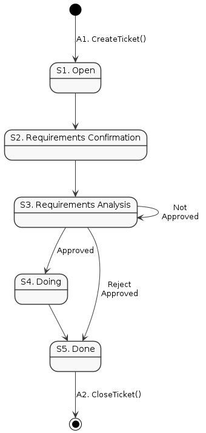
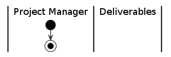

# [@ CRM] Change Request Management

[@doc ghost 0.4]

本プロセスは、課題管理プロセスのデフォルト課題タイプである変更依頼課題タイプの、変更依頼プロセスを定める。

 

## CONTENTS <!-- omit in toc -->

- [1. DESCRIPTION](#1-description)
  - [1.1. Purpose](#11-purpose)
  - [1.2. Status Model](#12-status-model)
    - [1.2.1. Entry Criteria / Stimulus](#121-entry-criteria--stimulus)
    - [1.2.2. State Flow](#122-state-flow)
    - [1.2.3. States and Activities](#123-states-and-activities)
    - [1.2.4. Exit Criteria / Output Parameter](#124-exit-criteria--output-parameter)
  - [1.3. Application Process Interface](#13-application-process-interface)
- [2. PROCESS ROLES](#2-process-roles)
  - [2.1. [@role] Change Request Issuer](#21-role-change-request-issuer)
  - [2.2. [@role] Change Request Registrant](#22-role-change-request-registrant)
  - [2.3. [@role] IssueAssignee](#23-role-issueassignee)
  - [2.4. [@role] Project Manger](#24-role-project-manger)
  - [2.5. [@role] Change Control Board](#25-role-change-control-board)
- [3. WORK PRODUCTS](#3-work-products)
  - [3.1. [@workproduct] Change Request Management Master Plan](#31-workproduct-change-request-management-master-plan)
  - [3.2. [@workproduct] Request Acceptance Criteria](#32-workproduct-request-acceptance-criteria)
  - [3.3. [@workproduct] Change Request Tracking Record](#33-workproduct-change-request-tracking-record)
- [4. STATES AND ACTIVITIES](#4-states-and-activities)
  - [4.1. [@activity] Plan](#41-activity-plan)
  - [4.2. [@activity] Monitor](#42-activity-monitor)
  - [4.3. [@activity] CreateTicket](#43-activity-createticket)
  - [4.4. [@state] Open](#44-state-open)
  - [4.5. [@state] RequirementsConfirmation](#45-state-requirementsconfirmation)
  - [4.6. [@state] RequirementsAnalysis](#46-state-requirementsanalysis)
  - [4.7. [@state] Doing](#47-state-doing)
  - [4.8. [@state] Done](#48-state-done)
  - [4.9. [@activity] CloseTicket](#49-activity-closeticket)
- [5. APPENDIX](#5-appendix)
  - [5.1. 参考：Automotive SPICE V3.1の主要関連項目](#51-参考automotive-spice-v31の主要関連項目)

 

## 1. DESCRIPTION

### 1.1. Purpose

変更依頼管理プロセスの目的は、変更依頼が管理され、追跡され、実装されることを確実にすることである。

- 製品仕様あるいはプロジェクト計画に変更を及ぼす依頼を対象とする。
- プロジェクト初期の概略仕様から段階的に詳細化・追加されてゆく過程のすべてを変更として取り扱う。

[参考：Automotive SPICE V3.1の主要関連項目](#61-参考automotive-spice-V31の主要関連項目)

 

### 1.2. Status Model

#### 1.2.1. Entry Criteria / Stimulus

| @id | Name | Description |
| :-: | ---- | ----------- |
| E1  | Change request | 変更依頼： 製品仕様あるいはプロジェクト計画に影響を及ぼす、追加・削除を含む変更依頼。

#### 1.2.2. State Flow

|  |
| :-: |
| fig.1.1 Change request State flow

#### 1.2.3. States and Activities

##### A1. [CreateTicket()](#42-activity-createticket) <!-- omit in toc -->

- 依頼を受け取った際、速やかにチケットを起票し依頼情報を記録する。
- オリジナルデータを確実に記録し、チケットから参照可能にする。
  - チケットそのものに添付するか、記録管理する。
  - メール、議事録、白板スキャン、なんでもよいのでなんらかのエビデンスを。

##### S1. [Open](#43-state-open) <!-- omit in toc -->

- **WAITING STATE**： 担当者のアサインを待つ

##### S2. [RequirementsConfirmation](#44-state-requirementsconfirmation) <!-- omit in toc -->

- 分析の起点となるニーズ情報を網羅的に把握する。
  - 要求を識別する。
- 必要に応じて要求の折り返し確認を行う。

##### S3. [RequirementsAnalysis](#45-state-requirementsanalysis) <!-- omit in toc -->

- 変更依頼を分析し、要件開発を行う。
- 変更依頼は大別すると、製品仕様変更に関する要求と、計画変更に関する要求とがある。
  - 製品仕様にかかわる要求の場合は、仕様開発を行う。
  - プロジェクト計画に関する変更依頼の場合は、変更案を作成する。

- インパクト評価を行い、受入れ可否判断を行う。

> 備考 2: 一般的な分析基準には、リソース要件、スケジュール観点、リスク、利点等がある。

- 依頼発行者のレビューを実施し合意を得る。
- 必要に応じてCCBによる承認を得る。

##### S4. [Doing](#46-state-doing) <!-- omit in toc -->

- 実施内容に応じて課題チケットを発行し、関連を記録する。
- 終了をモニターする。
  - 必要に応じて依頼発行者へレポートを行う。

- 終了時、依頼発行者へレポートを行う。

##### S.5 [Done](#47-state-done) <!-- omit in toc -->

- **WAITING STATE**： Close判定を待つ

##### A2. [CloseTicket()](#48-activity-closeticket) <!-- omit in toc -->

- Close判定を行い、チケットをクローズする。

#### 1.2.4. Exit Criteria / Output Parameter

| @id | Name | Description |
| :-: | ---- | ----------- |
| X1  | 更新された作業成果物リスト | 新規登録された作業成果物は、その管理基準・検証基準が明示されていること。

 

### 1.3. Application Process Interface

チケットによるプロセス実行の他に、変更依頼管理プロセス自身の制御のために以下のAPIを持つ。

| Activity name | Description |
| ------------- | ----------- |
| [Plan](#41-activity-plan)                     | 変更依頼管理基本計画を立案し、運用開始する。
| [Monitor](#42-activity-monitor)               | 作業成果物管理の運用状況を取得する。これを定期的に実行することで監視を行う。

 

## 2. PROCESS ROLES

### 2.1. [@role] Change Request Issuer

| @id | Name | Description |
| --- | ---- | ----------- |
| CRI | ChangeRequestIssuer | 変更依頼発行者 

### 2.2. [@role] Change Request Registrant

| @id | Name | Description |
| --- | ---- | ----------- |
| AC  | ChangeRequestRegistrant | 変更依頼登録者 

### 2.3. [@role] IssueAssignee

| @id | Name | Description |
| --- | ---- | ----------- |
| IA  | IssueAssignee | 課題担当者 

### 2.4. [@role] Project Manger

| @id | Name | Description |
| --- | ---- | ----------- |
| PM  | ProjectManager | プロジェクトマネージャー 

### 2.5. [@role] Change Control Board

| @id | Name | Description |
| --- | ---- | ----------- |
| CCB | ChangeControlBoard | 変更管理委員会 変更依頼内容をレビューし受入れを決定する責任を負う、１人以上のステークホルダー。

- プロセス記述の都合上、本書では1人の場合もCCBと呼ぶ。
- プロジェクト基本計画にてメンバーを定める。

 

## 3. WORK PRODUCTS

### 3.1. [@workproduct] Change Request Management Master Plan

| @id | Name | Description |
| --- | ---- | ----------- |
| CRMMP | ChangeRequestManagementMasterPlan | プロジェクトニーズに基づく作業成果物管理マスタープラン

### 3.2. [@workproduct] Request Acceptance Criteria

| @id | Name | Description |
| --- | ---- | ----------- |
| RAC | ChangeRequestAcceptanceCriteria | 変更依頼受入れ基準： 

> 備考 2: 一般的な分析基準には、リソース要件、スケジュール観点、リスク、利点等がある。

### 3.3. [@workproduct] Change Request Tracking Record

| @id | Name | Description |
| --- | ---- | ----------- |
| RAC | ChangeRequestTrackingRecord | 変更依頼追跡記録： 変更依頼チケット（Change Request Ticket）

 

## 4. STATES AND ACTIVITIES

### 4.1. [@activity] Plan

#### _[@P] PURPOSE_ <!-- omit in toc -->

変更依頼管理基本計画を立案し、運用開始する。

#### _[@E] ENTRY CRITERIA / INPUT PARAMETER_ <!-- omit in toc -->

1. プロジェクト基本計画書

#### _[@F] ACTIVITY FLOW_ <!-- omit in toc -->

|  |
| :-: |
| fig.4.1 'Plan' activity flow

#### _[@T] TASKS_ <!-- omit in toc -->

| @id | Name | Description | Role |
| :-: | ---- | ----------- | :--: |
| T1  | 作業成果物リストの更新 | アプリケーションプロセスの計画更新に応じて、各Work product Listを更新する。 必要に応じてリポジトリ配置の調整を行う。
|     | @plugin | [PST.SWE::Initiate](../plugins/SelectTable.md#activity-wpminitiate).T1();

1. 変更依頼受入れ承認階層の定義

   - Define the change request acceptance and approval hierarchy.

2. 変更依頼受入れ基準および変更管理委員会メンバーの定義

#### _[@V] VERIFICATION_ <!-- omit in toc -->

| @id | Name | Description | Role |
| :-: | ---- | ----------- | :--: |
| V1  | プロジェクトマネジメント概要計画書のレビュー |
|     | @plugin | [PST.PM::Initiate](../plugins/SelectTable.md#21-activity-initiate).V1();

#### _[@D] DELIVERABLES_ <!-- omit in toc -->

| @id | Name | Description |
| :-: | ---- | ----------- |
| D1  | Work product List | 作業成果物リスト

#### _[@Q] QUALITY RECORDS_ <!-- omit in toc -->

| @id | Name | Owner | Description |
| :-: | ---- | :---: | ----------- |

#### _[@X] EXIT CRITERIA / OUTPUT PARAMETER_ <!-- omit in toc -->

| @id | Name | Description |
| :-: | ---- | ----------- |
| X1  | 更新された作業成果物リスト | 新規登録された作業成果物は、その管理基準・検証基準が明示されていること。

 

### 4.2. [@activity] Monitor

| Id | Activity name | Description |
| -- | ------------- | ----------- |
| MON | Monitor       | 作業成果物管理の運用状況を取得する。
|     | @Note         | これを定期的に実行することで監視を行う。

#### _[@P] PURPOSE_ <!-- omit in toc -->

- Work product managementプロセスの運用ステータスを収集する。

#### _[@E] ENTRY CRITERIA / INPUT PARAMETER_ <!-- omit in toc -->

1. プロジェクト基本計画書に計画された定期実行タイミング

#### _[@F] ACTIVITY FLOW_ <!-- omit in toc -->

| ![[@fig:puml PUML.WPM::Initiate]](WorkproductManagement/Monitor.png) |
| :-: |
| fig.4.1 'Initiate' activity flow

- SystemAdmin が実行することになっているが、ACでよいかもしれない。SQAアプリから呼ばれ、SQEによって実行されるかもしれないため。

#### _[@T] TASKS_ <!-- omit in toc -->

| @id | Name | Description | Role |
| :-: | ---- | ----------- | :--: |
| T1  | 作業成果物管理プロセス運用状況の取得 | 作業成果物管理プロセス基本計画に従い、運用状況を確認し、記録する。
|     | @plugin | [PST.SWE::Initiate](../plugins/SelectTable.md#activity-wpminitiate).T1();
| T2  | 問題の識別と記録 | 運用状況が基本計画に定めた基準に満たない場合、問題点を識別して記録する。 補足：課題管理プロセス::問題管理チケットを発行する。
|     | @plugin | [PST.SWE::Initiate](../plugins/SelectTable.md#activity-wpminitiate).T1();

#### _[@V] VERIFICATION_ <!-- omit in toc -->

| @id | Name | Description | Role |
| :-: | ---- | ----------- | :--: |
| V1  | プロジェクトマネジメント概要計画書のレビュー |
|     | @plugin | [PST.PM::Initiate](../plugins/SelectTable.md#21-activity-initiate).V1();

#### _[@D] DELIVERABLES_ <!-- omit in toc -->

| @id | Name | Description |
| :-: | ---- | ----------- |
| D1  | Work product List | 作業成果物リスト

#### _[@Q] QUALITY RECORDS_ <!-- omit in toc -->

| @id | Name | Owner | Description |
| :-: | ---- | :---: | ----------- |

#### _[@X] EXIT CRITERIA / OUTPUT PARAMETER_ <!-- omit in toc -->

| @id | Name | Description |
| :-: | ---- | ----------- |
| X1  | 更新された作業成果物リスト | 新規登録された作業成果物は、その管理基準・検証基準が明示されていること。

 

### 4.3. [@activity] CreateTicket

### 4.4. [@state] Open

### 4.5. [@state] RequirementsConfirmation

### 4.6. [@state] RequirementsAnalysis

### 4.7. [@state] Doing

### 4.8. [@state] Done

### 4.9. [@activity] CloseTicket

 

## 5. APPENDIX

### 5.1. 参考：Automotive SPICE V3.1の主要関連項目

#### SUP.10 変更依頼管理 <!-- omit in toc -->

> - 変更依頼管理プロセスの目的は、変更依頼が管理され、追跡され、実装されることを確実にすることである。
>   - (1) 変更依頼管理戦略が策定されている。
>   - (2) 変更に対する依頼が記録され、識別されている。
>   - (3) 他の変更依頼との依存性および関係性が識別されている。
>   - (4) 変更依頼の実装内容を確認するための基準が定義されている。
>   - (5) 変更に対する依頼が分析され、リソース要件が見積られている。
>   - (6) 変更が、分析結果および利用可能なリソースに基づいて優先順位を付けられ、承認されている。
>   - (7) 承認された変更が実装され、終結まで追跡されている。
>   - (8) すべての変更依頼のステータスが把握されている。
>   - (9) **双方向トレーサビリティが、変更依頼と影響を受ける作業成果物との間で確立されている。**

 

[^ TOP](#-crm-change-request-management)
