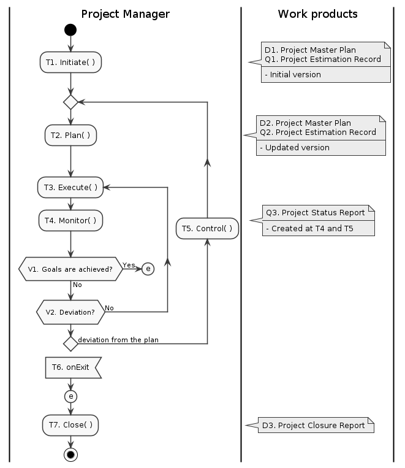

# [@Ghost PIM] Project Integration Management Process

[@doctype ghost 0.4]

## 1. Description

本プロセスは、プロジェクトの統合マネジメントを行う。プロジェクトライフサイクル全体について定義し、マネジメント・エンジニアリング・品質保証それぞれをプランし、実施・調整し、完了させる、プロジェクト遂行の最上位プロセスとなる。

本プロセスは、プロジェクトライフサイクル全体をあらわすMainアクティビティと、Mainアクティビティから呼び出されるサブアクティビティを含んでいる。

本プロセスの各アクティビティを通じて、プロジェクトインスタンス固有の情報を保持するプロジェクト基本計画書を作成、維持する。プロジェクト基本計画書はプロジェクト内グローバルな成果物であり、全てのプロセス・アクティビティから参照可能である。プロジェクト終結時には、プロジェクト完了報告書が作成される。

本プロセスの全てのアクティビティは、プロジェクトマネージャーによって実施される。

 

## 2. PROCESS ROLES

### 2.1. [@role] Project Manager

| @id | Name | Description |
| --- | ---- | ----------- |
| PM  | ProjectManager | プロジェクトを遂行し、成果を作り出すことに責任をもつ。

 

## 3. WORK PRODUCTS

### 3.1. [@workproduct] Project Master Plan

| @id | Name | Description |
| --- | ---- | ----------- |
| PMP     | ProjectMasterPlan | プロジェクト基本計画書。プロジェクトインスタンスのルート文書となる。以下の各計画関連書類をまとめたもので、プロジェクト内各所からアクセスされるグローバル構造体。
| _@part_ | PIM.PC | Project Charter
| _@part_ | PIM.SH | Stakeholders
| _@part_ | SWE.OP | Software engineering Outline plan
| _@part_ | SQA.OP | Software quality assurance Outline plan
| _@part_ | PM.OP  | Project management Outline plan
| _@part_ | WPM.OP | Work product management Outline plan
| _@part_ | ISM.OP | Issue management Outline plan

### 3.2. [@workproduct] Project Closure Report

| @id | Name | Description |
| --- | ---- | ----------- |
| PCR | ProjectClosureReport | プロジェクト終了報告書。 "[プロジェクト終了報告書は、プロジェクトの成功を評価し、プロジェクトの成果物のカタログを作成し、プロジェクトを正式に終了する最終文書です。プロジェクト終了報告書の主な目的は、プロジェクトの成功と失敗の全体像を提供することです。プロジェクト終了報告書には、利害関係者、監査人、将来のプロジェクトマネージャーが、プロジェクト期間中に何が達成され、どのように作業が完了したかを明確に理解できるように、すべての重要なプロジェクト情報が含まれていなければなりません。](https://www.washington.edu/asa/project-management-draft/project-management-resources/templates/closure-project-closure-report/)"

 

## 4. ACTIVITIES

### 4.1. [@activity] Main

#### [@P] PURPOSE

- プロジェクトライフサイクル全体について、定義し、プランし、実施・調整し、完了させる。

#### [@E] ENTRY CRITERIA / INPUT

1. 初期段階のプロジェクト概要計画情報（見積提案書レベル）。ゴール、スコープ、制約・コスト、納期及び中間スケジュールの概要情報を含む。

#### [@F] ACTIVITY FLOW

|  |
| :-: |
| fig.4.1 'Main' activity flow

##### _[@T] TASKS_

- [ ] TODO: T2-Plan では、次のイベントまでのエピックを確定し、バックログを積むことをExit Criteriaに含める。
- [ ] また、上位プロジェクト計画（車両日程など）との接続方法についても説明を付加する。

| @id | Name | Description | Role |
| :-: | ---- | ----------- | :--: |
| T1  | [Initiate()](#42-activity-initiate)  | < ProjectMasterPlan = this.Initiate() > プロジェクト情報を収集し、プロジェクトを定義し、承認を得てプロジェクトを開始する。 | PM
| T2  | Plan()      | < ProjectMasterPlan = this.Plan(ProjectMasterPlan) >  プロジェクトのプランニングを行う。プロジェクトマネジメントプラン、エンジニアリングプランを具体化し、これにあわせて品質保証プランを策定する。 | PM
| T3  | Execute()   | < this.Execute(ProjectMasterPlan) >  プロジェクトマネジメントの実行プロセスを通じて、プロジェクトの各プランを実行に移す。 | PM
|     | @note       | Iteration Plannning |
| T4  | Monitor()   | < this.Monitor(ProjectMasterPlan) >  プロジェクトプランに基づき、プロジェクト活動を監視する。プロジェクトステータスレポートを発行する。 | PM
|     | @note       | Iteration Retrospective |
| T5  | Control()   | < this.Control(ProjectMasterPlan) >  プロジェクトの進捗・問題、プロジェクトをとりまく状況変化に応じてプロジェクトプランを調整、制御する。 | PM
| T6  | onExit      | プロジェクト強制終了時のエントリーポイント |
| T7  | Close()     | < ProjectClosureReport = this.Close(ProjectMasterPlan) >  プロジェクトを終結する。 | PM

##### _[@V] VERIFICATION_

| @id | Name | Description | Role |
| :-: | ---- | ----------- | :--: |
| V1  |      | プロジェクトゴールへの到達度合いを検証する。 到達した場合は、終了処理（T6. Close）へ移る。 | PM
| V2  |      | プロジェクトプランからの逸脱を検証する。 逸脱が観測された場合には、課題制御・プラン調整を行う（T5. Control）。逸脱がなければ、次のプランを実行する（T3. Execute）。 | PM

##### _[@D] DELIVERABLES_

| @id | Name | Description |
| :-: | ---- | ----------- |
| D1  | Project Master Plan : PMP    | プロジェクト基本計画書・初期版。 プロジェクト開始時に収集された情報に基づいてプロジェクトが定義され、概要計画が行われ、初期見積もりのベースとなるバージョン。
| D2  | Project Master Plan : PMP    | プロジェクト基本計画書・更新版。 初期版に更新を重ねたバージョン。詳細計画が行われ、状況に応じて修正されたもの。
| D3  | Project Closure Report : PCR | プロジェクト完了報告書。プロジェクトの結果をまとめ、次のプロジェクトへの情報を提供する。

##### _[@Q] QUALITY RECORDS_

| @id | Name | Description |
| :-: | ---- | ----------- |
| Q1  | Project Estimation Record | プロジェクト見積記録・初期版。 プロジェクト基本計画書・初期版に基づくプロジェクト見積りの記録。
| Q2  | Project Estimation Record | プロジェクト見積記録・更新版。 プロジェクト基本計画・更新版に基づくプロジェクト見積りの記録。
| Q3  | Project Status Report     | プロジェクトステータスレポート。 運用計画により、週次・月次、社内向け・顧客向けなど複数種類があり得る。

#### [@X] EXIT CRITERIA / OUTPUT

| @id | Name | Description |
| :-: | ---- | ----------- |
| X1  | プロジェクト活動完了の承認 | プロジェクト活動の完了がプロジェクトステータスレポートにより報告され、承認されている。
| X2  | プロジェクト完了報告書の承認 | プロジェクト完了報告書が作成され、承認されている。

 

### 4.2. [@activity] Initiate

#### [@P] PURPOSE

- プロジェクト情報を収集し、プロジェクトを定義し、承認を得てプロジェクトを開始する。

#### [@E] ENTRY CRITERIA / INPUT

1. 初期段階のプロジェクト概要計画情報（見積依頼書などプロジェクト検討開始の起点となる情報群）

#### [@F] ACTIVITY FLOW

| ![[@fig.puml.activity ProjectIntegrationManagement.puml/Initiate]](ProjectIntegrationManagement/Initiate.png) |
| :-: |
| fig 4.2 'Initiate' activity flow

##### _[@T] TASKS_

- [ ] TODO: T1 にて、プロジェクト開始のための基準を提示する。そうしないと、どこまで初期計画を作成しなければならないかわからない。
- [ ] V1 は、組織毎にことなるが、例えば社内別部署にて実現性レビューを実施し承認を得るケースもある。

| @id | Name | Description | Role |
| :-: | ---- | ----------- | :--: |
| T1  | Define the project | プロジェクトを定義する。プロジェクト基本計画書を新規作成し、初期段階のプロジェクト概要計画情報(E1)の内容をもとに以下のパートを策定する。 1. PIM.PC : Project charter 2. PIM.SH : Project Stakeholders | PM
|     | @plugin | [PST.PIM::Initiate](../plugins/SelectTable.md#activity-piminitiate).T1();
| T2  | [SWE::Initiate()](SoftwareEngineering.md#41-activity-initiate) | < ProjectMasterPlan = SWE::Initiate(ProjectMasterPlan) > 開発対象ソフトウェアの特徴・課題を把握し、開発方針・技術戦略の策定を行う。 3. SWE.OP : Software engineering Outline Plan | PM
| T3  | [SQA::Initiate()](SoftwareQualityAssurance.md#41-activity-initiate) | < ProjectMasterPlan = SQA::Initiate(ProjectMasterPlan) > ソフトウェア品質保証観点から情報収集し、品質保証戦略の策定を行う。 4. SQA.OP : Software quality assurance Outline Plan | PM
| T4  | [PM::Initiate()](ProjectManagement.md#41-activity-initiate) | < ProjectMasterPlan = PM::Initiate(ProjectMasterPlan) > プロジェクトマネジメント観点から情報収集し、プロジェクトマネジメント概要計画の策定を行う。 5. PM.OP  : Project management Outline Plan | PM
|     | @note | T2, T3, T4 の各タスクは相互に強く影響を及ぼすため連携して進めること。 |
| T5  | WPM::Initiate() | < WPM::Initiate(ProjectMasterPlan) > Work product Management を開始する。 | PM
| T6  | ISM::Initiate() | < ISM::Initiate(ProjectMasterPlan) > Issue Management プロセスを開始する。 | PM
| T7  | PM::Estimate(ProjectMasterPlan) | < ProjectEstimationRecord = PM::Estimate(ProjectMasterPlan) > プロジェクトの初期見積を行う。 | PM
| T8 | Create initial baseline of Project master plan and Estimation record. | < WPM::MergeRequest(develop, master) > Create an initial baseline of the Project master plan and Estimation record. Then, the project started. プロジェクト基本計画書をマスターブランチへ発行して初版とし、プロジェクトを正式スタートする。 | PM
|     | @note | @todo プロジェクトキックオフの実施を追加する。 |

##### _[@V] VERIFICATION_

| @id | Name | Description | Role |
| :-: | ---- | ----------- | :--: |
| V1  | Evaluate feasibility of the _ProjectMasterPlan_. | プロジェクト基本計画の妥当性・実現可能性を検証する。妥当でない場合は、対応方針を示して再度 T1, T2, T3 を実施する。 < WPM::Verify(ProjectMasterPlan) > | PM
|     | @plugin | [PST.PIM::Initiate](../plugins/SelectTable.md#activity-sweinitiate).T1();
| V2  | PM::GetApproval(ProjectMasterPlan, ProjectEstimationRecord) | < Approval = PM::GetApprova(ProjectMasterPlan, ProjectEstimationRecord) > プロジェクト基本計画に定める責任分担に従ってプロジェクト基本計画およびプロジェクト見積を検証し、プロジェクト開始の承認を得る。 | PM

##### _[@D] DELIVERABLES_

| @id | Name | Description |
| :-: | ---- | ----------- |
| D1  | Project Master Plan : PMP | プロジェクト基本計画書・新規作成版。 テンプレートから複製され、初期段階のプロジェクト概要計画情報が記載されたもの。プロジェクト憲章と責任分担が記載され、プロジェクト基本計画策定を開始するためのバージョン。
| D2  | Project Master Plan : PMP | プロジェクト基本計画書・初期版。 プロジェクト開始時に収集された情報に基づいてプロジェクトが定義され、概要計画が行われ、初期見積もりのベースとなるバージョン。

##### _[@Q] QUALITY RECORDS_

| @id | Name | Description |
| :-: | ---- | ----------- |
| Q1  | Project Estimation Record | プロジェクト基本計画書・初期版に基づくプロジェクト見積り記録。プロジェクト基本計画書とともに、プロジェクト終結まで修正・維持される。

#### [@X] EXIT CRITERIA / OUTPUT_

| @id | Name | Description |
| :-: | ---- | ----------- |
| X1  | プロジェクト基本計画および見積の承認 | プロジェクト基本計画がその見積りを含めて検証・承認されていること。これに伴い、リソースの割当が開始されていること。
| X2  | プロジェクトリポジトリの運用開始 | プロジェクトリポジトリが準備され、プロジェクト基本計画書が収集されたプロジェクト情報、プロジェクト見積記録とともに、ベースライン化されていること。

 

### 4.3. [@activity] Plan

#### _[@P] PURPOSE_

- _Project Master Plan_ の基本計画を、スケジューリング可能な優先順位付き課題の集合に詳細化する。
- ワークパッケージを、実行可能・検証可能な粒度まで再帰的に分割し、優先順位を設定する。  
  → Sprint planning に入れる状態にする

#### _[@E] ENTRY CRITERIA / INPUT_

- プロジェクト基本計画書

#### _[@F] ACTIVITY FLOW_

| ![[@fig:puml PUML.PIM::Plan]](ProjectIntegrationManagement/Plan.png) |
| :-: |
| fig 4.3 'Planning' activity flow

#### _[@T] TASKS_

- [ ] TODPO: T1-T3 の作業用に、WBSシートを用意するか、Jiraの使い方を示すか、なにか考える。プラグインで実現すればよさげ。ここではあくまで要件だけ書く。用語だけ決めないとダメか・・・

| @id | Name | Description | Role |
| :-: | ---- | ----------- | :--: |
| T1  | ワークパッケージのブレークダウン | ワークパッケージを必要に応じて階層化し、複数ワークパッケージへ詳細化あるいは複数ステップに分割し、それを実施すべき特定のマイルストーン区間に配置する。 2回目以降のプランニングではこれの見直し、調整を行う。 → T1=SWE(), T2=SQA() のそれぞれで実施する。
| T3  | 優先順位とワークパッケージスケジュールの調整 | 依存関係、リソース、リスクなどを考慮し、優先順位を調整する。
|     | @plugin | [PST.PIM::Plan](../plugins/SelectTable.md#activity-pimplan).T3();

#### _[@V] VERIFICATION_

| @id | Name | Description | Role |
| :-: | ---- | ----------- | :--: |
| V1  | ワークパッケージスケジュールのレビュー | ワークロード、リソース、納期、コストなどの観点から、制約逸脱がないか検証する。

#### _[@D] DELIVERABLES_

| @id | Name | Description |
| :-: | ---- | ----------- |
| D1  | ワークパッケージスケジュール | 優先順位付き階層化ワークパッケージを、マイルストーン区間に割付けるレベルでスケジューリングしたもの。

#### _[@X] EXIT CRITERIA / OUTPUT_

| @id | Name | Description |
| :-: | ---- | ----------- |
| X1  | 実施可能なワークパッケージスケジュール |

 

### 4.3. [@activity] Execute

#### _[@P] PURPOSE_

- ワークパッケージスケジュールに従い、ワークパッケージを課題に分割し、実行に移す。

#### _[@E] ENTRY CRITERIA / INPUT_

- プロジェクト基本計画書
- ワークパッケージスケジュール

#### _[@F] ACTIVITY FLOW_

| ![[@fig:puml PUML.PIM::Execute]](ProjectIntegrationManagement/Execute.png) |
| :-: |
| fig 4.3 'Execute' activity flow

#### _[@T] TASKS_

| @id | Name | Description | Role |
| :-: | ---- | ----------- | :--: |
| T1  | PM::Execute()

#### _[@V] VERIFICATION_

| @id | Name | Description | Role |
| :-: | ---- | ----------- | :--: |
| V1  | ワークパッケージスケジュールのレビュー | ワークロード、リソース、納期、コストなどの観点から、制約逸脱がないか検証する。

#### _[@D] DELIVERABLES_

| @id | Name | Description |
| :-: | ---- | ----------- |
| D1  | ワークパッケージスケジュール | 優先順位付き階層化ワークパッケージを、マイルストーン区間に割付けるレベルでスケジューリングしたもの。

#### _[@X] EXIT CRITERIA / OUTPUT_

| @id | Name | Description |
| :-: | ---- | ----------- |
| X1  | 実施可能なワークパッケージスケジュール |
