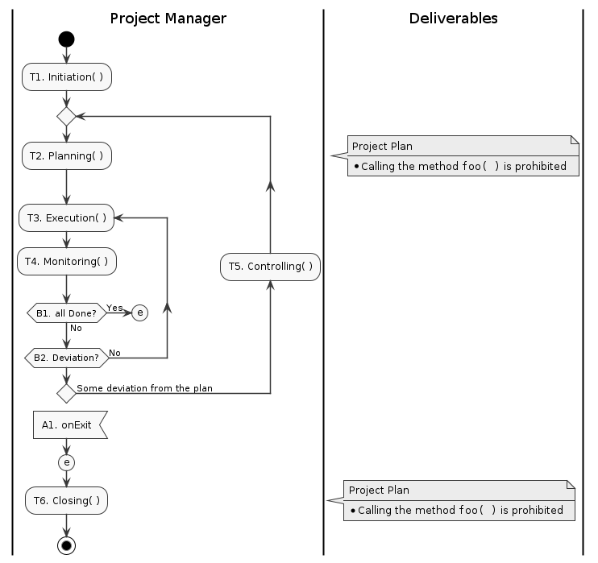

# Ghost process

 

## CONTENTS <!-- omit in toc -->

- [1. PROCESS OVERVIEW](#1-process-overview)
  - [1.1. Process map](#11-process-map)
  - [1.2. Application Layer](#12-application-layer)
    - [1.2.1. Project Management](#121-project-management)
    - [1.2.2. Software Engineering](#122-software-engineering)
    - [1.2.3. Quality Assurance](#123-quality-assurance)
  - [1.3. Middleware Layer](#13-middleware-layer)
    - [1.3.1. Issue Management](#131-issue-management)
    - [1.3.2. Workproduct Management](#132-workproduct-management)
  - [1.4. Tools Abstraction Layer](#14-tools-abstraction-layer)
    - [1.4.1. Issue Tracking System](#141-issue-tracking-system)
    - [1.4.2. Git Hosting Service](#142-git-hosting-service)
    - [1.4.3. Strage](#143-strage)
- [2. STARTING A PROJECT](#2-starting-a-project)
  - [2.1. Overview](#21-overview)
  - [2.2. Project Initiation](#22-project-initiation)
    - [2.2.1. Creating the project charter](#221-creating-the-project-charter)
    - [2.2.2. Analysis of Characteristic conditions of the project](#222-analysis-of-characteristic-conditions-of-the-project)
    - [2.2.3. Process deployment](#223-process-deployment)
  - [2.3. Project Planning](#23-project-planning)

## 1. PROCESS OVERVIEW

### 1.1. Process map

| ![[@fig:puml PUML.README::]](README/Ghost_Process_Orverview.png) |
| :-: |
| fig.1.1 Ghost process Overview

### 1.2. Application Layer

#### 1.2.1. Project Management

##### Project Integration Management <!-- omit in toc -->

##### Project Management <!-- omit in toc -->

#### 1.2.2. Software Engineering

#### 1.2.3. Quality Assurance

### 1.3. Middleware Layer

#### 1.3.1. Issue Management

#### 1.3.2. Workproduct Management

Work product Managementプロセスは、プロジェクト/プロセスの実施により作成されるWork productを構成管理もしくは記録管理し、あらかじめ計画された検証実施を確実にする手順を提供する。

- アプリケーションプロセスの実施およびプロジェクト活動により作成される作業成果物の保管機能を提供する。
- 保管の際、予め定められた検証基準を満たしていることをレビューし結果を記録する。
  具体的検証内容・検証実施はアプリケーションプロセスにより実施されるが、最終確認を本プロセスで行うことで検証漏れを防ぐ防御壁となる。

詳細を[Work product management](WorkproductManagement.md)に示す。

### 1.4. Tools Abstraction Layer

#### 1.4.1. Issue Tracking System

#### 1.4.2. Git Hosting Service

#### 1.4.3. Strage

## 2. STARTING A PROJECT

### 2.1. Overview

|  |
| :-: |
| fig.4.1 ProjectIntegrationManagement::Main activity flow

### 2.2. Project Initiation

#### 2.2.1. Creating the project charter

#### 2.2.2. Analysis of Characteristic conditions of the project

プロジェクトの特徴的条件の分析を行う。
Analyze the characteristic conditions of the project.

#### 2.2.3. Process deployment

> #### PA 3.2 Process deployment process attribute
>
> プロセス展開プロセス属性は、標準プロセスがプロセス成果を達成するために定義されたプロセスとして展開されている程度を示す測定項目である。このプロセス属性を十分に達成した場合の達成成果は、以下のとおりである。
>
> - a) 定義されたプロセスが、適切に選定した標準プロセス、および／またはテーラリングを実施した標準プロセスに基づいて展開されている。
> - b) 定義されたプロセスを実施するために必要となる役割、責任、および権限が、割り当てられ、伝達されている。
> - c) 定義されたプロセスを実施する要員が、適切な教育、トレーニング、および経験に基づいて適任である。
> - d) 定義されたプロセスを実施するために必要となるリソースおよび情報が、利用可能とされ、割り当てられ、使用されている。
> - e) 定義されたプロセスを実施するために必要となるインフラおよび作業環境が、利用可能とされ、管理され、維持されている。
> - f) プロセスの適切性および有効性を実証するため、ならび継続的なプロセス改善の潜在箇所を評価するために、プロセスの振る舞いを理解する根拠となる適切なデータが、収集され、分析されている。

### 2.3. Project Planning
